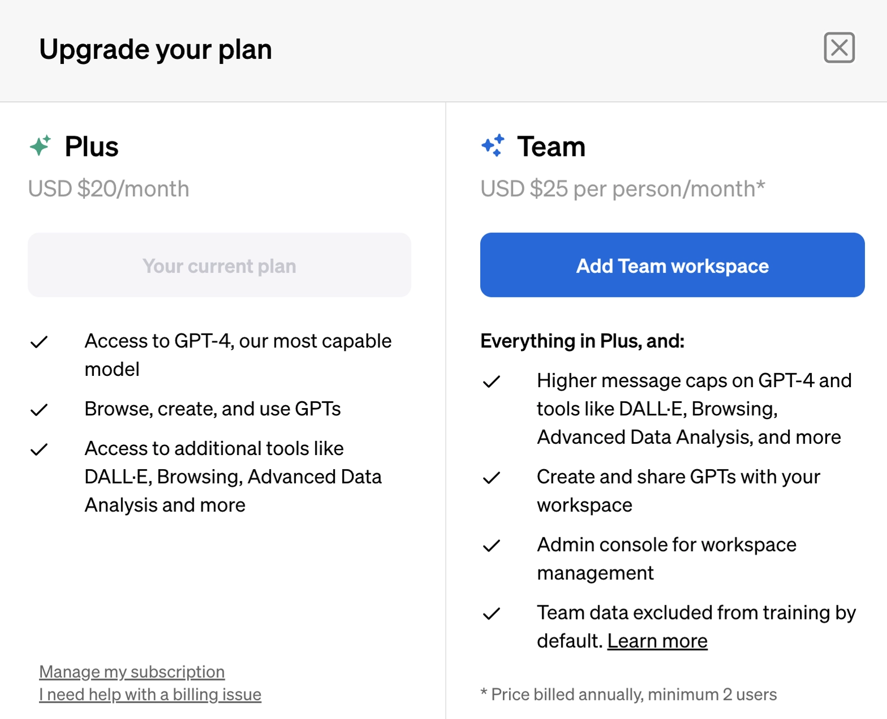
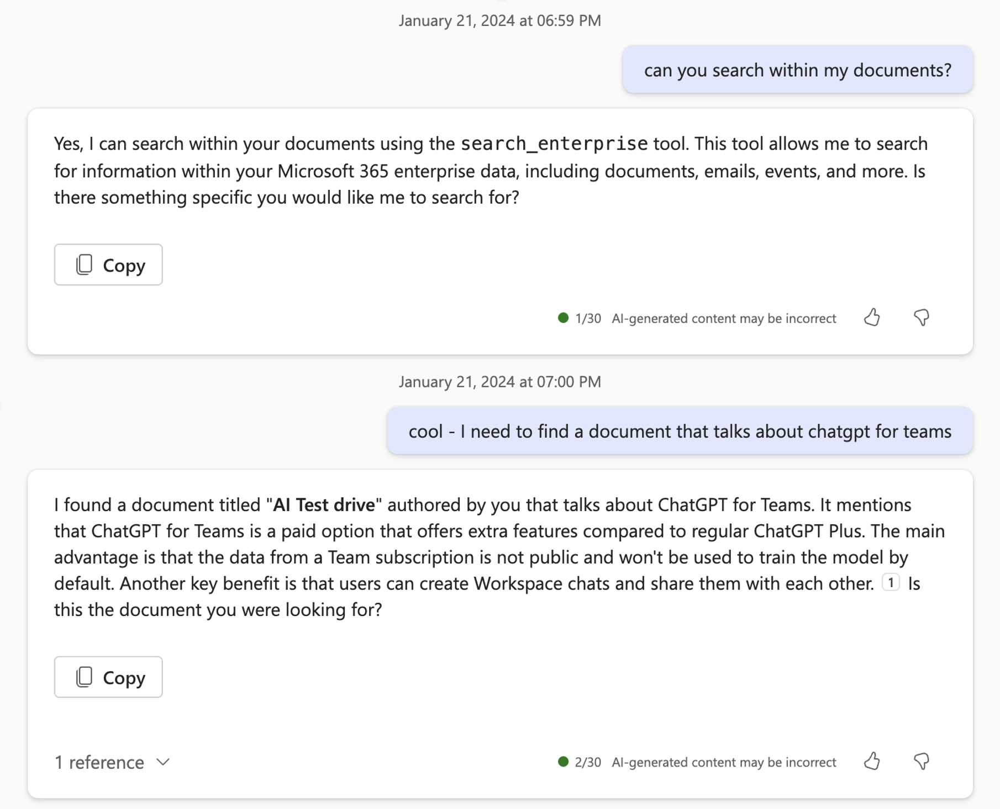

# ChatGPT Teams vs Copilot for Microsoft 365：哪个更适合你的团队？

---

在AI助手满天飞的今天，你可能会困惑：ChatGPT Teams和Copilot for Microsoft 365到底选哪个？这不是"谁更强"的问题，而是"谁更适合你"的问题。这篇文章会告诉你它们各自擅长什么，以及如何根据你的实际工作场景做选择。

---

## 先说清楚，它们是什么

### ChatGPT是个什么东西?

想象一个特别能聊的朋友，你问它什么，它都能接上话——这就是ChatGPT。它背后用的是机器学习算法，能理解你说的话，然后预测下一个词该是什么，最终生成一段完整的回复。你给的信息越详细，它的答案就越靠谱。

ChatGPT能干的事情挺多：写邮件、写代码、总结文章、编诗、做简历……基本上文字相关的活儿它都能搭把手。

**ChatGPT Teams**是付费版本，相比普通的ChatGPT Plus多了几个实用功能：团队聊天记录默认不会被用来训练模型（这点很重要），而且可以创建工作区聊天并分享给团队成员。如果你想在团队场景下使用AI工具，又担心数据隐私问题，👉 [ChatGPT Teams会员是个不错的选择](https://shaoyumi.com/buy/65)，价格透明，质保30天。

### Copilot for Microsoft 365又是啥？

Copilot不是一个独立的聊天工具，它更像是嵌入到你日常使用的Microsoft 365应用里的智能助手。它不仅能调用大语言模型（LLM），还能访问你在Microsoft 365里的数据——日历、邮件、聊天记录、文档、会议内容等等——然后在这些工具里直接帮你提高效率。

比如在Word里，Copilot可以帮你改写段落、扩充内容，甚至建议你加点什么主题。最实用的是"和文档聊天"功能：如果你有一份几百页的报告，想快速找到某个关键信息，直接问Copilot就行，不用自己翻来翻去。

## 它们到底有什么不同？

虽然ChatGPT Teams和Copilot都用了OpenAI的GPT-4 Turbo模型，但它们是完全不同的产品。ChatGPT Teams是个"全能选手"，在同一个界面里处理各种任务；Copilot则是"专业辅助"，专注于在Microsoft 365应用内提供帮助。

它们的共同点也很明显：
- 都用最新的OpenAI模型
- 都承诺数据安全，不会用你的数据训练新模型

### Copilot的优势在哪？

Copilot和Microsoft 365的整合程度是ChatGPT无法比的。举个例子，你可以用Copilot在整个文档空间里搜索，然后让它总结搜索结果——这种深度整合是ChatGPT做不到的。

### ChatGPT的杀手锏是什么？

没有任何一个Microsoft 365 Copilot能比得上ChatGPT的通用性。它能创建和分析任何东西。特别是数据分析功能，这是Copilot目前还没有的（也许以后会有？）。

另外，ChatGPT支持自定义GPT。虽然这还是个新领域，但社区已经在快速探索如何把各种工具和ChatGPT结合起来。这也是Microsoft 365 Copilot暂时做不到的。

### 产品成熟度的差异

从产品发展阶段来看，ChatGPT已经上线一年多了，这让OpenAI在产品打磨上比微软团队稍微领先一点。Copilot相对来说还比较新，用户可能会觉得有些功能还不够完善。Copilot的一个明显短板是不支持多语言，这点ChatGPT就没问题。

### 价格对比

两个产品的价格差不多：

> ChatGPT Teams是每用户每月25美元（最少2个用户），Copilot for Microsoft 365是每用户每月30美元。

需要注意的是，两个产品都要求预付一年费用，而且价格不含税。

## 总结一下

ChatGPT和Copilot for Microsoft 365都是强大的AI助手，能帮你工作得更快、更好、更有创造力。它们各有千秋，选哪个取决于你的实际需求。

ChatGPT Teams在通用性、数据分析和自定义GPT方面更强，而Copilot for Microsoft 365的优势在于和微软应用的无缝整合。

成本差不多，但你要想清楚每个产品能给你带来什么价值。说实话，最好的办法就是自己试一试。可惜的是，两个产品目前都还没有免费试用。

如果你主要在Microsoft生态系统内工作，Copilot可能更合适；如果你需要一个更灵活、功能更全面的AI助手，👉 [ChatGPT Teams会员账号](https://shaoyumi.com/buy/65)会是更好的选择，特别是对于需要数据分析和定制化功能的团队来说。

---

**几个问题帮你做决定：**

- 你平时用Microsoft 365的应用（Word、Excel、PowerPoint、Outlook等）有多频繁？
- 你需要AI助手处理各种类型的任务，还是只用于某个特定场景（比如写作）？
- 你是否需要处理复杂任务和数据分析？
- 你想要自定义自己的AI工具，还是满足于产品提供的预设功能？

想清楚这些问题，你就知道该选哪个了。记住，AI助手没有万能的，适合自己的才是最好的。
